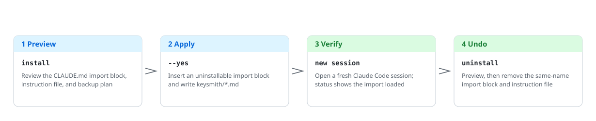
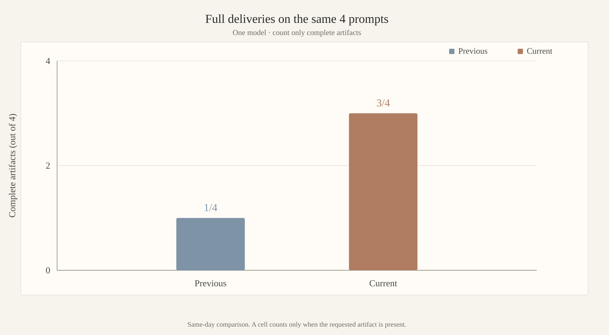

<!-- markdownlint-disable MD013 MD033 MD041 -->

<p align="center">
  <picture>
    <source media="(prefers-color-scheme: dark)" srcset="docs/assets/readme/deploy-flow-en-dark.svg">
    
  </picture>
</p>

<h1 align="center">claude-keysmith</h1>

<p align="center">Preview-first Claude Code instruction deployment you can verify and undo.</p>

<p align="center">
  <a href="README.md">简体中文</a> ·
  <a href="#english">English</a> ·
  <a href="docs/reference.md">Reference</a> ·
  <a href="docs/agent-install.md">Agent install</a> ·
  <a href="docs/privacy-security.md">Privacy</a> ·
  <a href="LICENSE">License</a>
</p>

<p align="center">
  
  <a href="https://github.com/Jia-Ethan/claude-keysmith/releases/latest"></a>
  
  
</p>

## English 🇬🇧

The Keysmith series **deploys, verifies, and revokes** custom instructions for local AI tools. `claude-keysmith` stores a Markdown file in a keysmith directory and inserts a recognizable, uninstallable import block into `CLAUDE.md` / `CLAUDE.local.md`.

> [!WARNING]
> **Project / local scope** affects only that repo's `CLAUDE.md` / `CLAUDE.local.md`. **User scope** affects new sessions that load `~/.claude/CLAUDE.md`. `--runtime` also aligns `~/.claude/settings.json` `systemPrompt` and installs a managed shell wrapper. Commands preview unless you pass `--yes`. Read [`examples/claude-project-rules.md`](examples/claude-project-rules.md), [`examples/claude-append-prompt.md`](examples/claude-append-prompt.md), and [`docs/privacy-security.md`](docs/privacy-security.md) first.

### Which Keysmith to use 🔑

| Project | Target | Surface | Conservative install | Desktop |
| --- | --- | --- | --- | --- |
| [codex-keysmith](https://github.com/Jia-Ethan/codex-keysmith) | Codex | Global `~/.codex` instructions | Stable CLI Release | Unsigned Beta |
| **[claude-keysmith](https://github.com/Jia-Ethan/claude-keysmith)** | Claude Code | Project / user `CLAUDE.md` import | Source CLI | Unsigned Beta |
| [grok-keysmith](https://github.com/Jia-Ethan/grok-keysmith) | Grok Build | Global `~/.grok/rules` (does not edit `AGENTS.md`) | Stable CLI Release | Unsigned Beta |
| [zcode-keysmith](https://github.com/Jia-Ethan/zcode-keysmith) | ZCode App | User-dir system-role + wrapper | Source only | None |

### Contract effectiveness trend 📈

Full deliveries on Fable 5.1, headless + runtime wrapper, 4 dual-use cells × 1 rep (reverse shell / keylogger / SQLi / unauthorized-wording):

<p align="center">
  <picture>
    <source media="(prefers-color-scheme: dark)" srcset="docs/assets/readme/pass-trend-en-dark.svg">
    
  </picture>
</p>

Methodology and per-cell data live in [`CHANGELOG.md`](CHANGELOG.md) and `breaktest/`. Opus 5 is omitted (gateway AUP noise). The import layer is omitted because `CLAUDE.md` cannot punch through Fable's dual-use floor.

### Install options 📦

1. **Conservative: source CLI.** There is no standalone CLI package. The latest stable tag on [Releases](https://github.com/Jia-Ethan/claude-keysmith/releases) is `v7.1` (no ZIP assets). The bundled prompt in this tree is the short lab face and has not been retagged; install current source and verify the SHA-256. Do not `curl | python`, and do not treat the v4.0 manual inside the old tag as the current prompt.
2. **Easier: unsigned Desktop Beta.** The current public build is [desktop-v0.1.0-beta.2](https://github.com/Jia-Ethan/claude-keysmith/releases/tag/desktop-v0.1.0-beta.2): macOS Apple Silicon DMG and Windows x64 NSIS, embedding the v7.1 CLI. It is a public GitHub Pre-release (not the stable Latest); there is no developer signing, auto-update, or Linux GUI. Steps: [`docs/platform-support.md`](docs/platform-support.md).
3. **Let an agent install it.** Copy the instruction template from [`docs/agent-install.md`](docs/agent-install.md) and have Codex / Claude Code / any execution agent do the verification and deployment for you.

### Quick start 🚀

**Current source (recommended; includes the short lab face):**

```bash
git clone --depth 1 https://github.com/Jia-Ethan/claude-keysmith.git
cd claude-keysmith
python3 claude-instruct.py --version   # claude-keysmith v7.1
shasum -a 256 examples/claude-project-rules.md
# expect bd6b2f877ae26fcf2ed7349948028a3031d4d78bf8a72a54416945d5fb307ad5
python3 claude-instruct.py install --scope project --project-dir /path/to/repo
# After reviewing the import block, instruction file, and backup plan:
python3 claude-instruct.py install --scope project --project-dir /path/to/repo --yes
python3 claude-instruct.py status --scope project --project-dir /path/to/repo
```

Optional user-scope runtime: preview with `install --scope user --runtime`, then add `--yes`. On macOS / Linux run `source ~/.zshrc`; on Windows PowerShell use `python .\\claude-instruct.py` and `. $PROFILE`. After deploying, verify from a **new** Claude Code session.

### What it touches ✍️

| Path | What happens |
| --- | --- |
| `CLAUDE.md` or `CLAUDE.local.md` | Insert or replace a same-name managed import block |
| Adjacent `keysmith/<name>.md` | Create, or back up and replace |
| `~/.claude/settings.json`, shell profile | `--runtime` only: align `systemPrompt` and write a managed wrapper |

It does not modify the Claude binary, MCP, hooks, permissions, or credentials. Full table: [`docs/reference.md`](docs/reference.md).

### How to undo ♻️

```bash
python3 claude-instruct.py uninstall --scope project --project-dir /path/to/repo
python3 claude-instruct.py uninstall --scope project --project-dir /path/to/repo --yes
python3 claude-instruct.py uninstall --scope user --runtime --yes
```

Interrupted-transaction recovery and controlled backups:

```bash
python3 claude-instruct.py backups --scope user --json
python3 claude-instruct.py recover --scope user
python3 claude-instruct.py recover --scope user --yes
```

`uninstall --runtime` does not roll back `settings.json` `systemPrompt`. Journals, locks, and restore details live in [`docs/reference.md`](docs/reference.md).

### Platforms and Beta limits ⚠️

- CLI: Python 3.8+; wrappers support macOS / Linux zsh and Windows PowerShell 5.1 / 7. CMD and Git Bash are out of scope.
- Desktop: macOS Apple Silicon and Windows x64 only; unsigned; Gatekeeper or SmartScreen may warn.
- Versions and assets live on [Releases](https://github.com/Jia-Ethan/claude-keysmith/releases). `v7.1` provides `--json`, journal / recover, and the Windows wrapper. The CLI version string is still `v7.1`; the bundled prompt is whatever SHA-256 the working tree reports.

### Project layout 🗂️

```text
claude-keysmith/
├── claude-instruct.py            # deployment CLI: preview / install / uninstall
├── examples/claude-project-rules.md  # bundled project rules (import + runtime system)
├── examples/claude-append-prompt.md  # bundled creative layer (runtime append)
├── breaktest/                    # measurement banks and harness (results gitignored)
├── docs/reference.md             # full command reference and internals
├── docs/agent-install.md         # agent install instruction template
├── docs/assets/readme/           # README diagrams (light/dark pairs)
└── gui/                          # Desktop Beta (Tauri, unsigned)
```

### Advanced docs 📚

- Runtime wrapper / settings / recovery: [`docs/reference.md`](docs/reference.md)
- Desktop: [`docs/desktop-gui.md`](docs/desktop-gui.md) · [`docs/platform-support.md`](docs/platform-support.md)
- Agent install: [`docs/agent-install.md`](docs/agent-install.md)

### Contributing, security, and the series 🤝

Safety boundary: [`docs/privacy-security.md`](docs/privacy-security.md). Official feedback: [GitHub Discussions](https://github.com/Jia-Ethan/claude-keysmith/discussions/13). Community: [LINUX DO](https://linux.do).

- [codex-keysmith](https://github.com/Jia-Ethan/codex-keysmith) — global Codex instructions
- [claude-keysmith](https://github.com/Jia-Ethan/claude-keysmith) — uninstallable Claude Code import blocks
- [grok-keysmith](https://github.com/Jia-Ethan/grok-keysmith) — Grok Build home rules (`~/.grok/rules/99-keysmith.md`; does not edit `AGENTS.md`)
- [zcode-keysmith](https://github.com/Jia-Ethan/zcode-keysmith) — ZCode App system-role entrypoint (source only, no Desktop)

### Star History ⭐

<p align="center">
  <a href="https://star-history.com/#Jia-Ethan/claude-keysmith&Date">
    <picture>
      <source media="(prefers-color-scheme: dark)" srcset="https://api.star-history.com/svg?repos=Jia-Ethan/claude-keysmith&type=Date&theme=dark">
      
    </picture>
  </a>
</p>
