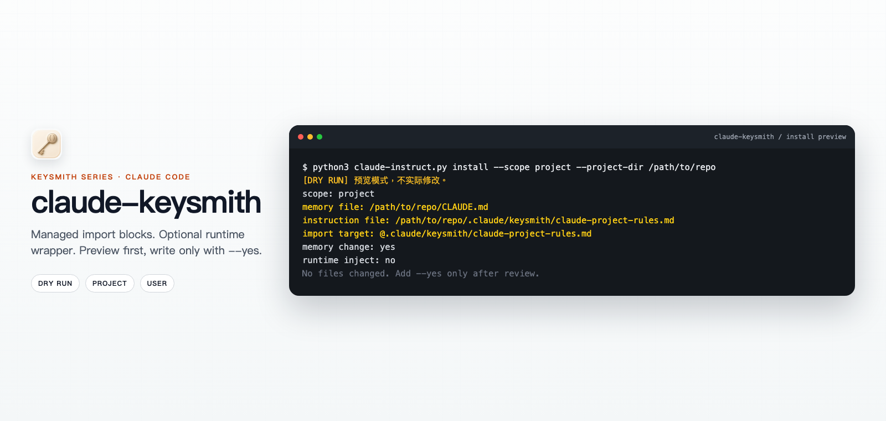

<!-- markdownlint-disable MD013 MD033 MD041 -->

<p align="center">
  
</p>
<p align="center"><em>Illustrative preview / 示意预览；actual paths and output follow the local dry-run.</em></p>

<h1 align="center">claude-keysmith</h1>

<p align="center">Preview-first Claude Code instruction deployment you can verify and undo.</p>

<p align="center">
  <a href="README.md">简体中文</a> ·
  <a href="#english">English</a> ·
  <a href="docs/reference.md">Reference</a> ·
  <a href="docs/agent-install.md">Agent install</a> ·
  <a href="docs/desktop-gui.md">Desktop</a> ·
  <a href="docs/privacy-security.md">Privacy</a> ·
  <a href="LICENSE">License</a>
</p>

<p align="center">
  
  
</p>

## English

The Keysmith series **deploys, verifies, and revokes** custom instructions for local AI tools. `claude-keysmith` stores a Markdown file in a keysmith directory and inserts a recognizable, uninstallable import block into `CLAUDE.md` / `CLAUDE.local.md`.

> [!WARNING]
> **Project / local scope** affects only that repo; **user scope** affects new sessions that load `~/.claude/CLAUDE.md`. `--runtime` also aligns `settings.json` `systemPrompt` and installs a managed shell wrapper. Commands preview unless you pass `--yes`. Read [`examples/claude-project-rules.md`](examples/claude-project-rules.md), [`examples/claude-append-prompt.md`](examples/claude-append-prompt.md), and [`docs/privacy-security.md`](docs/privacy-security.md) first.

### Which Keysmith to use

| Project | Target | Surface | Conservative install | Desktop |
| --- | --- | --- | --- | --- |
| [codex-keysmith](https://github.com/Jia-Ethan/codex-keysmith) | Codex | Global `~/.codex` instructions | Stable CLI Release | Unsigned Beta |
| **[claude-keysmith](https://github.com/Jia-Ethan/claude-keysmith)** | Claude Code | Project / user `CLAUDE.md` import | Source CLI | Unsigned Beta |
| [grok-keysmith](https://github.com/Jia-Ethan/grok-keysmith) | Grok Build | Global `~/.grok/rules` (does not edit `AGENTS.md`) | Stable CLI Release | Unsigned Beta |
| [zcode-keysmith](https://github.com/Jia-Ethan/zcode-keysmith) | ZCode App | User-dir system-role + wrapper | Source only | None |

### Install options

1. **Conservative: source CLI.** There is no standalone CLI package. Clone and run `claude-instruct.py`. GitHub Latest stable tag is `v6`; default branch and the Desktop sidecar are `v7` prerelease. Do not `curl | python`.
2. **Easier: unsigned Desktop Beta.** See [desktop-v0.1.0-beta.1](https://github.com/Jia-Ethan/claude-keysmith/releases/tag/desktop-v0.1.0-beta.1): macOS Apple Silicon DMG and Windows x64 NSIS, embedding the v7 CLI. No Linux GUI, no auto-update, no signing. Steps: [`docs/platform-support.md`](docs/platform-support.md).

### Quick start

```bash
git clone https://github.com/Jia-Ethan/claude-keysmith.git
cd claude-keysmith
python3 claude-instruct.py --version
python3 claude-instruct.py install --scope project --project-dir /path/to/repo
python3 claude-instruct.py install --scope project --project-dir /path/to/repo --yes
python3 claude-instruct.py status --scope project --project-dir /path/to/repo
```

Optional user-scope runtime: preview with `install --scope user --runtime`, then add `--yes`. On macOS / Linux run `source ~/.zshrc`; on Windows PowerShell use `python .\\claude-instruct.py` and `. $PROFILE`.

### What it changes

| Path | What happens |
| --- | --- |
| `CLAUDE.md` or `CLAUDE.local.md` | Insert or replace a same-name managed import block |
| Adjacent `keysmith/<name>.md` | Create, or back up and replace |
| `~/.claude/settings.json`, shell profile | `--runtime` only: align `systemPrompt` and write a managed wrapper |

It does not modify the Claude binary, MCP, hooks, permissions, or credentials. Full table: [`docs/reference.md`](docs/reference.md).

### How to undo

```bash
python3 claude-instruct.py uninstall --scope project --project-dir /path/to/repo
python3 claude-instruct.py uninstall --scope user --runtime --yes
python3 claude-instruct.py backups --scope user --json
python3 claude-instruct.py restore --target PATH --backup PATH --yes
python3 claude-instruct.py recover --scope user
```

`uninstall --runtime` does not roll back `settings.json` `systemPrompt`; restore from the pre-install backup when needed. Preview interrupted writes with `recover` before `--yes`.

### Platforms and Beta limits

- CLI: Python 3.8+; wrappers support macOS / Linux zsh and Windows PowerShell 5.1 / 7. CMD and Git Bash are out of scope.
- Desktop: macOS Apple Silicon and Windows x64 only; unsigned; Gatekeeper or SmartScreen may warn.
- Versions and assets live on [Releases](https://github.com/Jia-Ethan/claude-keysmith/releases) and [`docs/platform-support.md`](docs/platform-support.md).

### Advanced docs

- Runtime wrapper / settings: [`docs/reference.md`](docs/reference.md)
- Journals, locks, recovery: [`docs/transaction-recovery.md`](docs/transaction-recovery.md)
- JSON contract: [`docs/json-contract.md`](docs/json-contract.md)
- Desktop / agent install: [`docs/desktop-gui.md`](docs/desktop-gui.md) · [`docs/agent-install.md`](docs/agent-install.md)

### Contributing, security, and the series

```bash
python3 -m py_compile claude-instruct.py
python3 -m pytest tests
```

Safety boundary: [`docs/privacy-security.md`](docs/privacy-security.md). Community: [LINUX DO](https://linux.do).

- [codex-keysmith](https://github.com/Jia-Ethan/codex-keysmith) — global Codex instructions
- [claude-keysmith](https://github.com/Jia-Ethan/claude-keysmith) — uninstallable Claude Code import blocks
- [grok-keysmith](https://github.com/Jia-Ethan/grok-keysmith) — Grok Build home rules (`~/.grok/rules/99-keysmith.md`; does not edit `AGENTS.md`)
- [zcode-keysmith](https://github.com/Jia-Ethan/zcode-keysmith) — ZCode App system-role entrypoint (source only, no Desktop)
