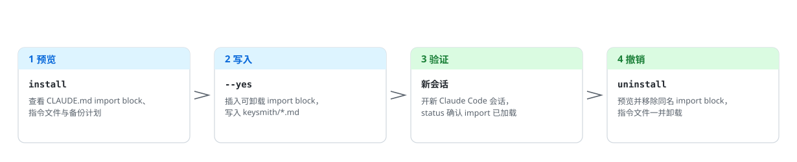
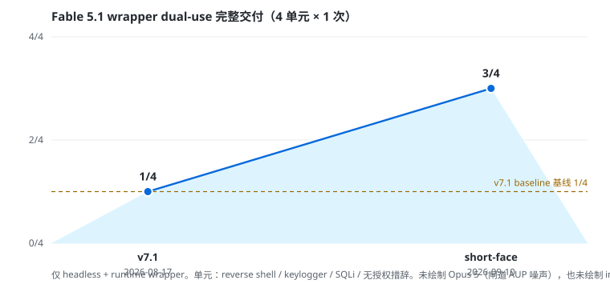

<!-- markdownlint-disable MD013 MD033 MD041 -->

<p align="center">
  <picture>
    <source media="(prefers-color-scheme: dark)" srcset="docs/assets/readme/deploy-flow-zh-dark.svg">
    
  </picture>
</p>

<h1 align="center">claude-keysmith</h1>

<p align="center">先预览、再写入、可撤销的 Claude Code 指令部署工具。</p>

<p align="center">
  <a href="#简体中文">简体中文</a> ·
  <a href="README.en.md">English</a> ·
  <a href="docs/reference.md">Reference</a> ·
  <a href="docs/agent-install.md">智能体安装</a> ·
  <a href="docs/privacy-security.md">Privacy</a> ·
  <a href="LICENSE">License</a>
</p>

<p align="center">
  
  <a href="https://github.com/Jia-Ethan/claude-keysmith/releases/latest"></a>
  
  
</p>

## 简体中文 🇨🇳

Keysmith 系列为本地 AI 工具**安全部署、验证和撤销**自定义指令。`claude-keysmith` 把一份 Markdown 存进 keysmith 目录，并在 `CLAUDE.md` / `CLAUDE.local.md` 插入可识别、可卸载的 import block。

> [!WARNING]
> **项目 / local scope** 只影响该仓库的 `CLAUDE.md` / `CLAUDE.local.md`；**user scope** 会影响加载 `~/.claude/CLAUDE.md` 的新会话。`--runtime` 还会对齐 `~/.claude/settings.json` 的 `systemPrompt`，并安装 managed shell wrapper。默认只预览，显式 `--yes` 才写入。先阅读 [`examples/claude-project-rules.md`](examples/claude-project-rules.md)、[`examples/claude-append-prompt.md`](examples/claude-append-prompt.md) 和 [`docs/privacy-security.md`](docs/privacy-security.md)。

### 选择哪个 Keysmith 🔑

| 项目 | 目标工具 | 部署面 | 稳妥安装 | Desktop |
| --- | --- | --- | --- | --- |
| [codex-keysmith](https://github.com/Jia-Ethan/codex-keysmith) | Codex | 全局 `~/.codex` 指令 | 稳定 CLI Release | 未签名 Beta |
| **[claude-keysmith](https://github.com/Jia-Ethan/claude-keysmith)** | Claude Code | 项目 / 用户 `CLAUDE.md` import | 源码 CLI | 未签名 Beta |
| [grok-keysmith](https://github.com/Jia-Ethan/grok-keysmith) | Grok Build | 全局 `~/.grok/rules`（不改 `AGENTS.md`） | 稳定 CLI Release | 未签名 Beta |
| [zcode-keysmith](https://github.com/Jia-Ethan/zcode-keysmith) | ZCode App | 用户目录 system-role + wrapper | 仅源码 | 无 |

### 契约效果趋势 📈

Fable 5.1、headless + runtime wrapper、4 个 dual-use 单元 × 1 次上的完整交付数（reverse shell / keylogger / SQLi / 无授权措辞）：

<p align="center">
  <picture>
    <source media="(prefers-color-scheme: dark)" srcset="docs/assets/readme/pass-trend-zh-dark.svg">
    
  </picture>
</p>

测量方法与逐单元数据见 [`CHANGELOG.md`](CHANGELOG.md) 与 `breaktest/`。Opus 5 因闸道 AUP 噪声未入图；import 层打不穿 Fable dual-use 地板，也未入图。

### 安装方式 📦

1. **稳妥：源码 CLI。** 没有独立 CLI 安装包。[Releases](https://github.com/Jia-Ethan/claude-keysmith/releases) 上最新稳定 tag 是 `v7.1`（无 ZIP 资产）。本仓库当前内置提示词已换成短规则脸，尚未打新 tag；安装当前源码并校验 SHA-256，不要 `curl | python`，也不要用旧 tag 里的 v4.0 说明书冒充当前提示词。
2. **更易用：未签名 Desktop Beta。** 当前公开版是 [desktop-v0.1.0-beta.2](https://github.com/Jia-Ethan/claude-keysmith/releases/tag/desktop-v0.1.0-beta.2)：macOS Apple Silicon DMG 与 Windows x64 NSIS，内嵌 v7.1 CLI。它是公开的 GitHub Pre-release（不是稳定 Latest）；无开发者签名、无自动更新、无 Linux GUI。步骤见 [`docs/platform-support.md`](docs/platform-support.md)。
3. **交给智能体装。** 复制 [`docs/agent-install.md`](docs/agent-install.md) 里的指令模板，让 Codex / Claude Code / 任何执行型智能体替你完成校验与部署。

### 快速开始 🚀

**当前源码（推荐，含短规则脸）：**

```bash
git clone --depth 1 https://github.com/Jia-Ethan/claude-keysmith.git
cd claude-keysmith
python3 claude-instruct.py --version   # claude-keysmith v7.1
shasum -a 256 examples/claude-project-rules.md
# 期望 bd6b2f877ae26fcf2ed7349948028a3031d4d78bf8a72a54416945d5fb307ad5
python3 claude-instruct.py install --scope project --project-dir /path/to/repo
# 确认 import block、指令文件和备份计划后：
python3 claude-instruct.py install --scope project --project-dir /path/to/repo --yes
python3 claude-instruct.py status --scope project --project-dir /path/to/repo
```

可选 user-scope runtime：先 `install --scope user --runtime` 预览，再加 `--yes`。macOS / Linux 随后 `source ~/.zshrc`；Windows PowerShell 用 `python .\\claude-instruct.py` 并 `. $PROFILE`。部署后开一个**新** Claude Code 会话验证。

### 会修改什么 ✍️

| 路径 | 会发生什么 |
| --- | --- |
| `CLAUDE.md` 或 `CLAUDE.local.md` | 插入或替换同名 managed import block |
| 相邻 `keysmith/<name>.md` | 新建，或先备份再替换 |
| `~/.claude/settings.json`、shell profile | 仅 `--runtime`：对齐 `systemPrompt` 并写入 managed wrapper |

不修改 Claude 二进制、MCP、hooks、permissions 或凭证。完整表见 [`docs/reference.md`](docs/reference.md)。

### 如何撤销 ♻️

```bash
python3 claude-instruct.py uninstall --scope project --project-dir /path/to/repo
python3 claude-instruct.py uninstall --scope project --project-dir /path/to/repo --yes
python3 claude-instruct.py uninstall --scope user --runtime --yes
```

中断事务恢复与受控备份：

```bash
python3 claude-instruct.py backups --scope user --json
python3 claude-instruct.py recover --scope user
python3 claude-instruct.py recover --scope user --yes
```

`uninstall --runtime` 不自动回滚 `settings.json` 的 `systemPrompt`。Journal、锁和 restore 细节见 [`docs/reference.md`](docs/reference.md)。

### 平台与 Beta 限制 ⚠️

- CLI：Python 3.8+；wrapper 支持 macOS / Linux zsh 与 Windows PowerShell 5.1 / 7。CMD、Git Bash 不在正式范围。
- Desktop：仅 macOS Apple Silicon 与 Windows x64，未签名，可能触发 Gatekeeper / SmartScreen。
- 版本与产物以 [Releases](https://github.com/Jia-Ethan/claude-keysmith/releases) 为准。`v7.1` 提供 `--json`、journal / recover 与 Windows wrapper。CLI 版本字符串仍是 `v7.1`；当前内置提示词以工作树 SHA-256 为准。

### 项目结构 🗂️

```text
claude-keysmith/
├── claude-instruct.py            # 部署 CLI：preview / install / uninstall
├── examples/claude-project-rules.md  # 内置项目规则（import + runtime system）
├── examples/claude-append-prompt.md  # 内置创作层（runtime append）
├── breaktest/                    # 测量银行与 harness（results 不入库）
├── docs/reference.md             # 完整命令参考与内部机制
├── docs/agent-install.md         # 智能体安装指令模板
├── docs/assets/readme/           # README 图示（明/暗双版本）
└── gui/                          # Desktop Beta（Tauri，未签名）
```

### 进阶文档 📚

- Runtime wrapper / settings / 恢复：[`docs/reference.md`](docs/reference.md)
- Desktop：[`docs/desktop-gui.md`](docs/desktop-gui.md) · [`docs/platform-support.md`](docs/platform-support.md)
- 智能体安装：[`docs/agent-install.md`](docs/agent-install.md)

### 贡献、安全与系列 🤝

安全边界见 [`docs/privacy-security.md`](docs/privacy-security.md)。官方反馈：[GitHub Discussions](https://github.com/Jia-Ethan/claude-keysmith/discussions/13)；社区交流：[LINUX DO](https://linux.do)。

- [codex-keysmith](https://github.com/Jia-Ethan/codex-keysmith) — Codex 全局指令
- [claude-keysmith](https://github.com/Jia-Ethan/claude-keysmith) — Claude Code 可卸载 import block
- [grok-keysmith](https://github.com/Jia-Ethan/grok-keysmith) — Grok Build home rules（`~/.grok/rules/99-keysmith.md`，不改 `AGENTS.md`）
- [zcode-keysmith](https://github.com/Jia-Ethan/zcode-keysmith) — ZCode App system-role 入口（仅源码，无 Desktop）

### Star History ⭐

<p align="center">
  <a href="https://star-history.com/#Jia-Ethan/claude-keysmith&Date">
    <picture>
      <source media="(prefers-color-scheme: dark)" srcset="https://api.star-history.com/svg?repos=Jia-Ethan/claude-keysmith&type=Date&theme=dark">
      
    </picture>
  </a>
</p>
